# qa-kit 현 상태 도식

**기준 시점**: 2026-05-17
**브랜치**: `claude/visualize-state-diagram-JsPFN`
**HEAD**: `e27b861` — Merge PR #1 (v0.2.7 GxP 표준 디자인 결정론적 적용)

## 1. 저장소 구조 + 컴포넌트 관계

```mermaid
flowchart TB
    Root["qa-kit (marketplace v1.0.0)<br/>branch: claude/visualize-state-diagram-JsPFN<br/>HEAD: e27b861 (v0.2.7 merge)"]:::root

    subgraph Meta["루트 메타"]
        MP[".claude-plugin/<br/>marketplace.json"]:::meta
        RM["README.md"]:::doc
        CH["CHANGELOG.md"]:::doc
        LC["LICENSE (MIT)"]:::doc
    end

    subgraph Docs["docs/"]
        SP["qa-scout/spec.md"]:::doc
    end

    subgraph Scout["plugins/qa-scout/ (v0.2.6)"]
        PJ[".claude-plugin/<br/>plugin.json"]:::meta
        SRM["README.md"]:::doc
        SCH["CHANGELOG.md"]:::doc

        subgraph Agents["agents/ (3)"]
            A1["scout.md<br/>(Sonnet · 오케스트레이션)"]:::sonnet
            A2["scout-curator.md<br/>(Haiku · 큐레이션)"]:::haiku
            A3["scout-analyzer.md<br/>(Opus · PRD 분석)"]:::opus
        end

        subgraph Skills["skills/ (3)"]
            S1["curate-input/<br/>SKILL.md"]:::skill
            S2["docs-to-function-spec/<br/>SKILL.md"]:::skill
            S3["markdown-to-sheets/<br/>SKILL.md"]:::skill
        end

        subgraph Scripts["scripts/feature-spec-design/"]
            SC1["apply.py"]:::script
            SC2["verify.py"]:::script
        end

        subgraph Templates["templates/"]
            T1["feature-spec/<br/>01_표지·02_변경이력·<br/>03_기능정의서·04_비기능요구·<br/>05_사용자스토리"]:::tmpl
            T2["feature-spec-design/<br/>sheets-layout.json·<br/>design-tokens.json"]:::tmpl
            T3["scout-output/ (v0.1 deprecated)<br/>function-spec·permission·<br/>state-transition·e2e-flow·<br/>layout·glossary"]:::tmpldep
            T4["handoff-meta.yaml<br/>input-manifest.yaml"]:::tmpl
        end
    end

    Root --> Meta
    Root --> Docs
    Root --> Scout
    MP -.publish.-> PJ
    A1 -.spawn.-> A2
    A1 -.spawn.-> A3
    A1 -.uses.-> S1
    A1 -.uses.-> S2
    A1 -.uses.-> S3
    S2 -.applies.-> T1
    SC1 -.applies.-> T2
    SC2 -.verifies.-> T2

    classDef root fill:#ffe0b2,stroke:#e65100,stroke-width:3px,color:#000
    classDef meta fill:#fff3e0,stroke:#fb8c00,color:#000
    classDef doc fill:#eceff1,stroke:#546e7a,color:#000
    classDef sonnet fill:#bbdefb,stroke:#1565c0,stroke-width:2px,color:#000
    classDef haiku fill:#c8e6c9,stroke:#2e7d32,stroke-width:2px,color:#000
    classDef opus fill:#d1c4e9,stroke:#4527a0,stroke-width:2px,color:#000
    classDef skill fill:#fff9c4,stroke:#f9a825,color:#000
    classDef script fill:#f8bbd0,stroke:#ad1457,color:#000
    classDef tmpl fill:#e1f5fe,stroke:#0277bd,color:#000
    classDef tmpldep fill:#eeeeee,stroke:#9e9e9e,stroke-dasharray: 4 4,color:#555
```

## 2. 한눈 요약 (현재 운영 상태)

| 항목 | 값 | 비고 |
|---|---|---|
| 마켓플레이스 | `qa-kit` v1.0.0 | `.claude-plugin/marketplace.json` |
| 수록 플러그인 | 1종 (`qa-scout`) | 향후 `qa-tc`·`qa-launch`·`qa-regression` 예정 |
| 플러그인 버전 | `plugin.json` v0.2.6 / 마켓 카탈로그 v0.2.5 | **버전 불일치 — 마켓 카탈로그 갱신 필요** |
| 최근 커밋 | `e27b861` v0.2.7 GxP 표준 디자인 결정론적 적용 | PR #1 머지 후 marketplace.json 미반영 |
| 에이전트 | 3종 (Sonnet·Haiku·Opus) | scout 오케스트레이션 + 2개 sub-agent |
| 스킬 | 3종 | curate-input · docs-to-function-spec · markdown-to-sheets |
| 스크립트 | 2종 (`apply.py`·`verify.py`) | v0.2.7 feature-spec-design 결정론 적용 |
| 템플릿 | feature-spec(5) · feature-spec-design(2) · scout-output(6, deprecated) · 메타(2) | |
| 작업 트리 | clean | 푸시 대기 변경 없음 |

## 3. 발견 사항

- **버전 불일치**: `plugin.json`은 v0.2.6, 마켓 `marketplace.json`은 v0.2.5. 최근 `feat: v0.2.7` 커밋이 머지되었으므로 두 파일 모두 v0.2.7로 동기화 검토 필요.
- **deprecated 디렉토리 잔존**: `templates/scout-output/` (v0.1 6종 markdown) — README는 deprecated로 명시하나 파일은 보존 중.
- **본 도식 파일**: 이 문서 자체가 `claude/visualize-state-diagram-JsPFN` 브랜치 산출물.
