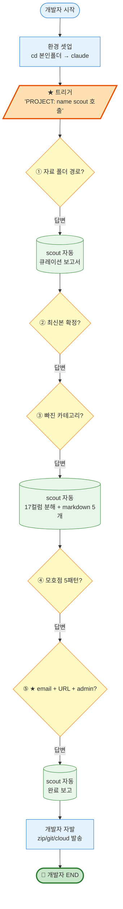
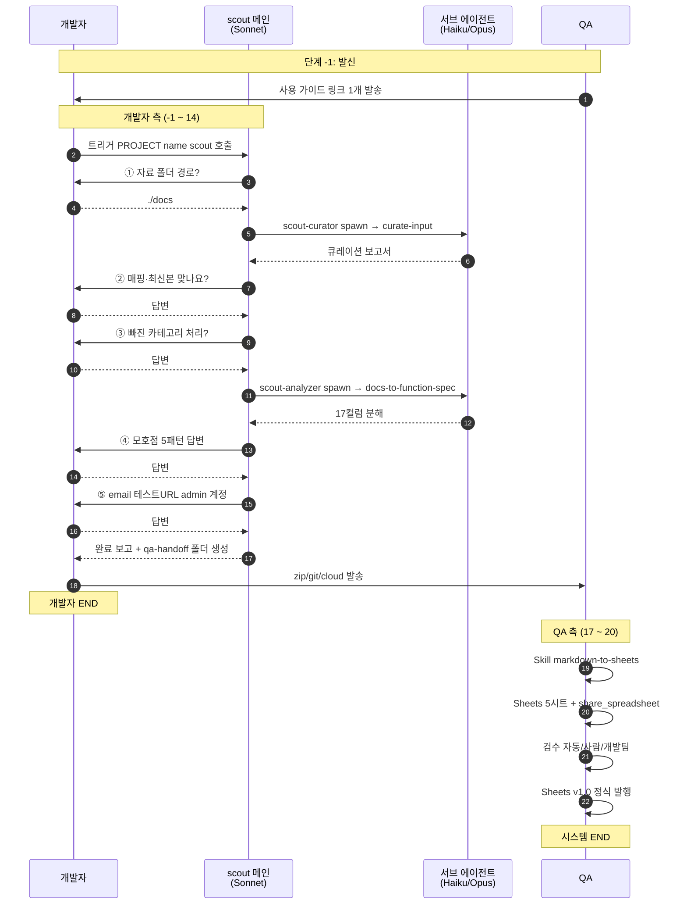
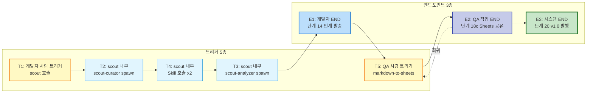

# qa-scout (v0.2)

> 개발자가 보유한 5종 도메인 지식을 인계받고 PRD를 GxP 양식 기능 정의서(Google Sheets 5시트, 17컬럼)로 정형화하는 Claude Code 플러그인.

**spec**: [../../docs/qa-scout/spec.md](../../docs/qa-scout/spec.md)

---

## 무엇을 해결하나?

기존 (v0.1):
```
개발팀 산출물 zip → QA 인사팀 → 6종 markdown 정형화 (30~60분, QA 부담)
```

v0.2 구조:
```
개발자 (Claude Code + 본 플러그인)
   ↓ scout 호출
   ├── PRD → GxP 양식 기능 정의서 (Google Sheets 5시트, 17컬럼)  ← 정형화
   └── 5종 도메인 지식 그대로 인계 + .meta.yaml 메타     ← 받기
   ↓ qa-handoff/{프로젝트}/ 폴더에 저장
   ↓ zip / git / 클라우드로 QA에게 인계
   ↓
QA (qa-workbench 측) → tc-writer·script-generator·spec-analyzer 등 후공정
```

## v0.2 주요 변경 (v0.1 대비)

- **6종 markdown → Google Sheets 5시트 + 받기 5종** (산출물 카테고리 재정의)
- **GxP 정형화 = 기능 정의서 1종** (받기 5종은 본문 변환 X, 그대로 인계)
- **17컬럼 평면 양식** (Sheets 22컬럼에서 운영 메타 3 + 다른 시트 흡수 3 제거 + TC ID·인풋 출처·비고 추가)
- **`qa-handoff/{프로젝트명}/` 표준 폴더 구조**
- **단계 -1 ~ 20 양방향 인계** (QA↔개발자)
- **이모티콘 전면 금지** (공식 문서)
- **자료 최신성 확인** 필수 (잘못된 버전 인풋 = GxP 위반)
- **신규 스킬 `curate-input`** (자료 큐레이션 V1 8단계)
- **운영 모드** (정정 6차) — 개발자는 markdown 인계, QA가 Sheets 이행 + 양방향 검수 (인사팀 + 개발팀)
- **모델 라우팅** (정정 7차) — sub-agent 2개 신설:
  - `scout-curator` (Haiku) — 단계 5 자료 큐레이션 (대량 파일 단순 패턴, 비용·속도 최적화)
  - `scout-analyzer` (Opus) — 단계 9 PRD 분석 (F-NNN 분해·BR 매핑·5패턴 모호점, 깊이 분석)
  - `scout` 메인 (Sonnet) — 오케스트레이션·markdown 작성·인터뷰
- **신규 스킬 `markdown-to-sheets`** (정정 6차) — QA 측 단계 17a Sheets 이행

## 효과

- **개발자 자체 정형화** — QA 인계 시 GxP 양식 통일
- **모호점 즉시 발견** — scout이 작성 중 5개 패턴 자동 탐지·질의
- **환각 방지** — 자료 없는 영역에 `[자료 부족]` 마커, 추정 금지
- **출처 표기 강제** — 행 단위 GxP 추적 (16번 "인풋 출처" 컬럼)
- **최신본 검증** — 단일 후보여도 사용자 확인

---

## 흐름 한눈에 보기 (도식)

> 본 섹션은 다른 개발자에게 짧게 설명할 때 그대로 보여줄 수 있는 형태입니다.

### 도식 1 — 개발자 관점 흐름 (★ 가장 중요)



**범례** — 파랑 개발자 행동 / 노랑 scout 질문 5개 / 초록 scout 자동 / 주황 트리거 / 진녹 종착점

### 도식 2 — 전체 흐름 Swim Lane (개발자 + scout + QA)



### 도식 3 — 트리거 5종 + 엔드포인트 3개



### 1분 설명 스크립트 (다른 개발자에게)

```
1) 이 플러그인이 뭐 하는 건가
   → "PRD + 도메인 지식 7카테고리를 받아서 GxP 기능 정의서로
      정형화해주는 Claude Code 플러그인"

2) 당신(개발자)은 무엇을 하나
   → "딱 5번 묻는 질문에 텍스트로 답변하면 됩니다.
      마지막에 결과물 폴더를 zip/git/cloud로 보내면 끝."

3) 5번의 질문은 뭐냐
   ① 자료 폴더 경로 (./docs)
   ② 최신본 맞나요 (PRD v2 확인 같은 것)
   ③ 빠진 카테고리 처리 (와이어프레임 없으면 라이브 URL?)
   ④ 모호점 답변 (같은 용어 다른 의미 등 5패턴)
   ⑤ ★ 본인 Google email + 테스트 URL + admin 계정
      (★ = 가장 중요. QA가 Sheets 공유·검수·자동화에 사용)

4) 당신의 종착점은 어디인가
   → "단계 14 — qa-handoff 폴더 묶어서 QA에게 발송한 시점"

5) 그 후엔
   → "QA가 markdown → Google Sheets로 옮기고 검수 → 최종 v1.0 발행.
      이 사이에 개발팀에 검수 요청 받을 수 있음.
      그때만 다시 들어와서 Sheets에 코멘트 남기면 됨."
```

### 1줄 요약

> qa-scout은 **개발자가 5개 질문에 답변만 하면 PRD를 GxP 양식으로 정형화하고 도메인 지식을 묶어서 인계 패키지로 만들어주는 Claude Code 플러그인**입니다. 개발자 작업은 **단계 14(인계 발송)에서 종료**되고, 그 후는 QA 측에서 Sheets 이행·검수·발행을 맡습니다.

---

## 1. 사전 준비 (3분)

| # | 항목 | 비고 |
|---|---|---|
| 1 | Claude Code CLI 설치 + 최신 버전 | `npm install -g @anthropic-ai/claude-code@latest`. v2.1.x 이상 필요 |
| 2 | 자료 폴더 정리 | PRD·유스케이스·시퀀스·와이어프레임·권한·용어집·ERD 7카테고리 — 다중 버전 있으면 최신본 식별 가능한 위치에 |
| 3 | 인계 채널 합의 | QA와 사전: zip(암호 zip 권장 — credentials 포함) / git push / 클라우드 중 1택 |
| 4 | 사전 합의 정보 미리 준비 | 본인 Google email, 테스트 도메인 URL, 어드민/테스트 계정 (단계 11b에서 묻습니다) |

---

## 2. 설치

### 옵션 A — qa-kit 마켓플레이스 (권장)

Claude Code에서 다음 두 명령:

```
/plugin marketplace add cmi94/qa-kit
/plugin install qa-scout@qa-kit
/reload-plugins
```

검증 — 슬래시 입력 후 자동완성에 `/curate-input (qa-scout)` 등 3개 노출되면 OK.

### 옵션 B — 수동 install

```bash
# 1. 에이전트 배치 (3개 agent)
cp plugins/qa-scout/agents/scout.md ~/.claude/agents/           # 메인 (Sonnet)
cp plugins/qa-scout/agents/scout-curator.md ~/.claude/agents/   # 단계 5 (Haiku)
cp plugins/qa-scout/agents/scout-analyzer.md ~/.claude/agents/  # 단계 9 (Opus)

# 2. 스킬 배치 (3개 skill)
cp -r plugins/qa-scout/skills/curate-input ~/.claude/skills/
cp -r plugins/qa-scout/skills/docs-to-function-spec ~/.claude/skills/
cp -r plugins/qa-scout/skills/markdown-to-sheets ~/.claude/skills/

# 3. 양식 템플릿 (선택 — scout이 자동 카피)
cp -r plugins/qa-scout/templates ~/.claude/templates/qa-scout/
```

---

## 3. 사용법 — 단계 -1 ~ 20

### 단계 -1: QA → 개발자 사전 인계

QA가 개발자에게 1회 발송:
- 플러그인 install 가이드 (위 §1)
- 사전 안내서 1쪽 (별도 자료)
- 인계 약속 합의 (zip / git / 클라우드 — 단계 14에서 선택, 일정)

### 단계 0~1: 개발자 환경 셋업

```bash
cd <자기 개발 폴더>     # 예: D:/work/myapp-dev/
claude                  # Claude Code 세션 시작
```

### 단계 2: 트리거 (PROJECT 헤더 포함)

```
> [PROJECT: myapp] scout 호출. MYAPP USER_PERMISSION 도메인 산출물 정형화 필요
```

**PROJECT 헤더 포함 원칙은 본 spec에서 확정**. 정확 트리거 키워드는 후속 결정 (현재 `scout 호출` 패턴 가정).

### 단계 3~4: 작업 폴더 + 자료 폴더 경로

scout가 `qa-handoff/{프로젝트명}/` 작업 폴더 생성. 자료 폴더 경로 요청:

```
> ./docs
```

(절대 또는 상대 경로, 다중 가능 — 콤마/줄바꿈 구분)

**라이브 환경 정보 (옵션):** 와이어프레임/화면 구조 자료가 부재하면 라이브 URL + 테스트 계정을 함께 제공할 수 있습니다. scout가 단계 5~6 보고서에서 묻습니다.

### 단계 5~6: 자동 스캔 + 매핑 + 최신본 식별 (★ 핵심)

scout이 `Skill: curate-input` 호출 → 단일 보고서 출력:

```
[자료 큐레이션 결과]

[PRD] 2건 — 최신 선택 필요
- PRD_v2.md (2026-04-15, ★★★)
- PRD_v1_old.md (2025-12-01, ★★★)
→ 어느 파일이 현재 유효한 PRD입니까?

[도메인 용어집] 1건
- ubiquitous-lang.md (2026-03-20, ★★★)
→ 이 파일이 최신 맞나요?

[유스케이스] 디렉토리 1건
- ./usecase/ (2 PNG, ★★)
→ 이 디렉토리가 최신?

...

[빠진 카테고리]
- 와이어프레임 → (a) 라이브 URL+계정 / (b) 자기 AI 생성 / (c) 생략
```

개발자 텍스트 답변:
```
> PRD는 v2.md, 유스케이스 디렉토리 맞음, 와이어프레임 라이브 URL: https://myapp.example.com 계정: <test-user>/<password>
```

### 단계 7~8: 빠진 카테고리 가이드 + 응답

(단계 5 보고서에 포함)

### 단계 9: 정형화 + 인계 (★ 핵심 출력)

scout이 다음 산출물 생성 — `qa-handoff/{프로젝트명}/` 안:

```
qa-handoff/myapp/
├── feature-spec (Google Sheets)                 ← GxP 정형화 (5시트)
│   ├── 01_표지
│   ├── 04_변경이력
│   ├── 06_기능정의서 (17컬럼)
│   ├── 07_비기능요구 (9컬럼)
│   └── 08_사용자스토리 (9컬럼)
├── domain-knowledge/                 ← 받기 5종 (그대로 인계)
│   ├── 01-user-scenario.{원본 형식}
│   ├── 01-user-scenario.meta.yaml
│   ├── 02-state-transition.{...}
│   ├── 03-screen-layout.{...}
│   ├── 04-permission-matrix.{...}
│   └── 05-glossary.{...}
├── _source/                          ← 모든 입력 자료 사본 (read-only)
├── input-manifest.yaml               ← 큐레이션 결과
└── scout-log.md                      ← 질의·결정 이력
```

### 단계 10~11: 모호점 추가 인터뷰

scout이 5개 패턴 발견 시 질의:
- 같은 용어 2가지 의미
- 행위자(누가) 불분명
- 입출력 필드 타입 불명
- 동일 기능 정의 충돌
- 단위 불명

### 단계 12: 완료 보고

```
[scout v0.2 정제 완료]
PROJECT: myapp
입력: 자료 9건 (확정 7·생략 2)
출력 위치: qa-handoff/myapp/
산출물 채움률: ...
질의 이력: 3건
다음: QA에게 인계 (단계 14 — 합의 옵션 따름)
```

### 단계 13~16: 개발자 → QA 인계

```bash
# 옵션 A: zip + Slack
Compress-Archive qa-handoff/myapp qa-handoff-myapp-2026-05-13.zip
# Slack에 첨부

# 옵션 B: git
git add qa-handoff/
git commit -m "qa-scout handoff: myapp USER_PERMISSION"
git push

# 옵션 C: Google Drive 등 + 공유 링크
```

QA가 무결성 점검 (input-manifest 일치, 모든 파일 존재).

### 단계 17~20: QA 측 후속

- `knowledge/{프로젝트}/scout-handoff/` 흡수
- 후공정 트리거 (검수 게이트·tc-writer·script-generator)
- 피드백 회귀

---

## 4. 환각 방지 — scout v0.2 6가지 가드

| # | 룰 | 의미 |
|---|---|---|
| 1 | 추정 금지 | 자료에 명시 안 된 내용 만들어내지 않음 |
| 2 | 최신본 확인 우선 | 단일 후보여도 사용자 확인 ("이게 최신 맞나요?") |
| 3 | `[자료 부족]` 마커 | 빈 셀에 자동 부착, 추정 채움 X |
| 4 | 출처 표기 강제 | 16번 "인풋 출처" 컬럼 (행 단위 GxP 추적) |
| 5 | 받기 5종 본문 변환 금지 | 양식 변환 X, `.meta.yaml`만 첨부 |
| 6 | 이모티콘 금지 | 공식 문서, 양식·로그·보고에 사용 X |

---

## 5. 보안 — credentials 인계

`input-manifest.yaml`에 단계 11b 수집 결과(개발자 email + 테스트 URL + admin 계정)가 포함되므로 인계 시 노출 위험.

권장 인계 매체:

| 매체 | 비고 |
|---|---|
| **zip 암호화 + 암호 별도 전송** | 가장 단순. 암호는 Slack DM·전화 등 별도 채널 |
| 1password vault link | 사내 1password 사용 시 |
| 암호화 메시지 (Signal·Wickr) | credentials 일부만 별도 전송 |
| **git push (지양)** | 부득이 시 `.gitignore`에 `input-manifest.yaml` 추가 또는 credentials을 `engagement-secrets.yaml`로 분리하고 그 파일만 별도 채널 |

운영 계정 절대 X — 단계 11b 인터뷰에서 테스트 전용 계정만 입력.

---

## 6. 자주 묻는 질문

### Q1. v0.1과 호환되나요?
- 부분 호환. v0.1 산출물(6종 markdown)은 v0.2 양식과 다름.
- v0.1 templates는 deprecated — `templates/scout-output/`. 신규 작업은 `templates/feature-spec/` 사용.

### Q2. 자료가 부족하면?
- scout이 빈 셀에 `[자료 부족]` 마커 부착하고 보고. 자료 보충 후 재호출하면 해당 셀만 갱신 (단계 14 옵션 c — 부분 갱신).

### Q3. 받기 5종 양식 변환 가능한가요?
- 안 됩니다. 사용자 정정 일관 — "그대로 인계". 후공정이 양식 가변 처리 (§7-2 후공정 처리 정책).

### Q4. PRD 안에 권한 매트릭스가 있는데?
- G16 정책 적용. PRD 본문 → feature-spec 정형화. PRD 권한 섹션 발췌 → `04-permission-matrix.md` (`.meta.yaml`에 `source: PRD §3.4` 명시). 원본 PRD는 `_source/` 보존.

### Q5. 사용자 시나리오 인풋이 유스케이스 + Process Flow 둘인데?
- G17 정책 적용. 별도 파일 인계 (`01-user-scenario-usecase.{ext}` + `01-user-scenario-flow.md`). 단일 인덱스 파일 옵션.

### Q6. ID 체계는 어떻게 정해지나요?
- 1차안: `FR-MYAPP-NNN`·`SCR-MYAPP-NNN`·`NFR-MYAPP-NNN`·`US-MYAPP-NNN`·`TC-MYAPP-NNN` (모듈 코드 MYAPP 단일, 결번 허용 3자리). 내부 ID owner 협의 후 최종.

### Q7. 트리거 키워드는 정해졌나요?
- PROJECT 헤더 포함 원칙은 본 spec 확정. 정확 키워드 패턴(`scout 호출` vs `/scout` 등)은 후속 결정.

### Q8. sub-agent (scout-curator/scout-analyzer) 자동 spawn 동작은 검증됐나요?
- 메인 `scout` (Sonnet) 직접 작성 모드는 도메인 1건 end-to-end 검증 완료.
- sub-agent spawn 경로(`scout-curator` Haiku / `scout-analyzer` Opus)는 첫 호출 시 동작 모니터링 권장 — 본 v0.2 시점 미검증 영역.
- 이상 시 메인 `scout` 직접 작성 모드로 폴백 가능 (동일 결과).

---

## 7. 트러블슈팅

| 증상 | 1차 대응 |
|---|---|
| `/plugin isn't available in this environment` | Claude Code 업그레이드 (`npm install -g @anthropic-ai/claude-code@latest`) — v2.1.x 이상 필요 |
| 자동완성에 `/curate-input (qa-scout)` 등 안 뜸 | `/plugin marketplace update qa-kit` → `/plugin uninstall qa-scout@qa-kit` → `/plugin install qa-scout@qa-kit` → `/reload-plugins` |
| `/reload-plugins` 출력에 `0 skills` 표시 | misleading. 실제 로드 검증은 자동완성 또는 자연어 호출로. 카운트 무시 OK |
| scout이 PROJECT 헤더 없다고 중단 | 트리거에 `[PROJECT: <project>]` 헤더 포함했는지 확인 |
| 자료 폴더 검증 실패 | 절대 경로 또는 작업 폴더 기준 상대 경로 (예: `./docs`). 폴더 존재·읽기 권한 확인 |
| 단계 11b에 운영 계정 입력하려는데 | 운영 계정 절대 X — 테스트 전용 계정만. 없으면 사내 IT/QA에 테스트 계정 발급 요청 |
| 그 외 | 본 plugin 저자 (chlauddls12@gmail.com) — `scout-log.md` 첨부 권장 |

---

## 8. 양식 참조

- 표지: `templates/feature-spec/01_표지.md`
- 변경이력: `templates/feature-spec/04_변경이력.md`
- 기능정의서 (17컬럼): `templates/feature-spec/06_기능정의서.md`
- 비기능요구: `templates/feature-spec/07_비기능요구.md`
- 사용자스토리: `templates/feature-spec/08_사용자스토리.md`
- 받기 5종 메타: `templates/handoff-meta.yaml`
- 큐레이션 결과: `templates/input-manifest.yaml`

---

## 9. 라이선스 / 문의

- 라이선스: MIT (`LICENSE` 파일은 [qa-kit 루트](../../LICENSE))
- 문의: 최명인 (chlauddls12@gmail.com)
- 마켓: https://github.com/cmi94/qa-kit
- source: https://github.com/cmi94/qa-kit/tree/main/plugins/qa-scout

## 10. 변경 이력

| 버전 | 일자 | 변경 |
|---|---|---|
| 0.1.0 | 2026-05-04 | 초기 출시 (도메인 파일럿용 — 6종 markdown 양식) |
| 0.2.0 | 2026-05-06 | 골격 재설계 — 5종 도메인 지식 인계 + 기능 정의서 GxP 정형화 (Google Sheets 5시트, 17컬럼) + qa-handoff/ 표준 폴더 + 단계 -1~20 양방향 인계 + ID 체계 1차안 + 모델 라우팅(scout-curator Haiku + scout-analyzer Opus + scout Sonnet 오케스트레이터) + qa-kit 마켓 publish |
