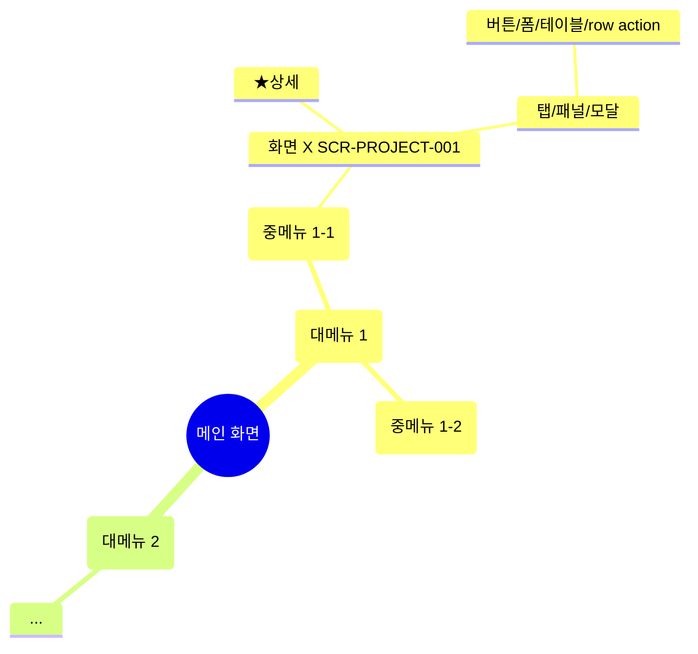

# {project} UI 메뉴 마인드맵

> v0.2.9 최종 읽기 산출물. 메인 화면 → 대메뉴 → 중메뉴 → 화면 → 탭/패널/모달 → 버튼/폼/테이블/row action까지 메뉴 트리를 기준으로 파고든다. Mermaid mindmap은 시각 보조, **§2 노드 상세 표가 SoT**. 자동 도출 후 단계 9d.5 cross-check 게이트로 `feature-spec.md`와 양방향 정합 검증.

## §0 범례

- `★` developer-pinned — 단계 1b deep-scope 인터뷰에서 개발자가 직접 지정 (must_open_targets[])
- `★상세` deep_screen_targets[].id 인용 — surface 일치만으로 PASS 금지 (SDD §5-7)
- `⚠` execution_gate.forbidden_actions[] 등재 항목 — decision이 `partial-execute`/`observe-only`일 때만 부착. `full-execute`는 모든 상태 변경 액션 실행 완료라 부착 X (SDD §5-10-4)
- `[자료부족]` `[상세 화면 구조 부족]` `[변수 동작 자료 부족]` `[상태별 UI 확인 필요]` `[권한별 UI 확인 필요]` `[문서-화면 충돌]` — v0.2.8 marker 그대로
- `[README 출처 — 본문 확인 필요]` — 노드가 README 1차 발견 경로에서 도출된 경우 (탐색 힌트, 단정 X — SDD §5-11-5)

### execution_gate.decision ↔ reviewer_status 1:1 매핑 (SDD §5-10-2)

| execution_gate.decision | reviewer_status | 의미 |
|---|---|---|
| `full-execute` | `EXECUTED-TEST-ENV` | 개발/QA/테스트 환경이며 금지 액션이 없어 승인 범위 안에서 상태 변경 액션까지 실행 가능 |
| `partial-execute` | `PARTIAL-OBSERVED` | 일부 상태 변경 액션은 금지되어 허용된 범위만 실행하고 나머지는 관찰/기록 |
| `observe-only` | `NOT-TESTED-PROD-RISK` | 운영/운영성 데이터/금지 액션 위험 때문에 상태 변경 액션은 실행하지 않고 관찰만 수행 |
| `context-insufficient` | `CONTEXT-INSUFFICIENT` | 환경·접근 조건·금지 액션 정보가 부족해 실행 판단 불가 |

본 표는 frontmatter `execution_policy.decision`·`execution_policy.reviewer_status` 두 필드를 채울 때 1:1 매핑 강제 기준이다. `feature-spec.md`와 동일 — enum 외 값 금지.

## §1 트리 시각화 (Mermaid mindmap)

> 본 시각화는 보조. 노드별 메타·인용·gap·forbidden·권한·FR-ID 매핑은 §2 표가 SoT.

### 작성 규칙

- **마인드맵 깊이는 최대 6단계.** Mermaid는 조망용이고, 깊이 초과 상세 정보는 §2 노드 상세 표가 SoT (마인드맵 가독성 보호).
- **기준 체인 (6단계 고정)**:
  1. `root` (메인 화면)
  2. `menu-l1` (대메뉴)
  3. `menu-l2` (중메뉴)
  4. `screen` (라우트 단위 화면)
  5. `tab` / `panel` / `modal` / `table` (화면 내 1차 구조)
  6. leaf — `row-action` / `button` / `field` / `link` / `form`
- 노드 종류는 SDD §5-3 enum 14종(`root` · `menu-l1` · `menu-l2` · `menu-l3` · `screen` · `tab` · `panel` · `modal` · `table` · `row-action` · `form` · `button` · `field` · `link`)으로 고정. 동적 영역 변화·state lifecycle·변수 marker insert/delete/serialize 등은 **노드 종류가 아니다** — 마인드맵에 그리지 않고 §2 표 비고 또는 deep_screen_targets[] 인용으로만 기록한다.
- **`menu-l3`(소메뉴)는 옵션**. `menu-l3`를 사용하면 6단계 한도를 보호하기 위해 leaf(`row-action`/`button`/`field`/`link`/`form`)와 상태(state)는 §2 노드 상세 표에 기록하고 Mermaid 트리에서는 6단계를 넘기지 않는다.
- 깊이 초과(변수 marker insert/delete/serialize, state lifecycle, 동적 영역 변화 등)는 Mermaid 트리에 그리지 않고 **§2 표 비고·deep_screen_targets[] 인용으로만 표현**.
- `screen` 노드만 `SCR-<PROJECT>-NNN` ID 인용. 그 외 노드는 §2 표 "경로" 컬럼으로 식별.
- Mermaid syntax 특수문자(`(`, `)`, `[`, `]`, `:`, `;`)는 노드 텍스트에 사용 X (escape 필요 시 §2 표 별도 표기).

## §2 노드 상세 표 (SoT — 마인드맵 위 모든 노드 1행씩)

| 경로 | 노드 종류 | 부모 경로 | SCR-ID | deep_target | 마커 | risky | role 노출 | gap | FR-ID 인용 | evidence |
|---|---|---|---|---|---|---|---|---|---|---|
| `/main` | root | (root) | `SCR-<PROJECT>-001` | — | — | — | all-roles | — | — | `capture:<main_slug>.yaml` |
| `/main → 대메뉴 1` | menu-l1 | `/main` | — | — | ★ | — | `<role>` | — | — | `<source> §x.x; capture:<nav_slug>.yaml` |
| `/main → 대메뉴 1 → 중메뉴 1-1` | menu-l2 | `/main → 대메뉴 1` | — | — | — | — | `<role>` | — | — | `<source> §y.y` |
| `/main → 대메뉴 1 → 중메뉴 1-1 → 화면 X` | screen | (위) | `SCR-<PROJECT>-NNN` | yes (id=`<target id>`) | ★상세 | — | `<role-A, role-B>` | structure-depth-gap | `FR-<PROJECT>-NNN~MMM` | `capture:<screen_slug>.yaml; <source> §z.z` |
| (위) → tab `<탭명>` | tab | 화면 X | — | yes | ★상세 | — | `<role>` | behavior-depth-gap | `FR-<PROJECT>-NNN` | `capture#tabs[0]` |
| (위) → button `<버튼명>` | button | 화면 X | — | — | — | ⚠ | `<role>` | — | `FR-<PROJECT>-MMM` | `capture#buttons[0]` |

### 채움 가이드

- 경로 컬럼은 sluggify X — 사람이 읽기. 자동 후공정에서는 옵션 `slug` 컬럼 추가 가능
- `deep_target` 컬럼은 `yes (id=<target id>)` 또는 `—`
- `마커` 컬럼: `★` / `★상세` / `[상세 화면 구조 부족]` 등 다중 가능 (공백 구분)
- `risky` 컬럼: `⚠` 또는 `—`. **execution_gate.forbidden_actions[]에 등재된 항목만 `⚠`**. `full-execute` decision은 ⚠ 부착 0건 정상
- `role 노출` 컬럼: role enum 또는 `all-roles` / `unknown` / `[권한별 UI 확인 필요]`
- `gap` 컬럼: §3 enum 7종 중 해당 항목
- `FR-ID 인용` 컬럼: **leaf 노드(button/row-action/field/form/table/modal)는 ≥ 1건 필수** (방향 B cross-check 검증 1)
- `evidence` 컬럼: 문서 §x.x / capture:<slug>.yaml#<selector> / design §y.y / README §z.z 등 다중 ;-구분

## §3 노드 종류 enum (14종 고정)

`root` · `menu-l1` (대메뉴) · `menu-l2` (중메뉴) · `menu-l3` (소메뉴 — 옵션) · `screen` (라우트 단위 화면) · `tab` · `panel` · `modal` · `table` · `row-action` · `form` · `button` · `field` · `link`

다른 종류는 추가 금지 (마인드맵 일관성). 새 종류 발견 시 SDD `../../docs/qa-scout/spec.md` 갱신 후 enum 확장.

## §4 deep_screen_targets[] 매핑 (input-manifest.yaml 인용)

| target id | 경로 노드 | gap_candidates | reason | forbidden_actions (관찰만) | required_observations |
|---|---|---|---|---|---|
| `<target id>` | `/main → ... → 화면 X` | structure-depth-gap, behavior-depth-gap | developer-pinned, capture-inputs-empty | `<액션 list — partial-execute / observe-only decision일 때만>` | tabs[`<탭1, 탭2>`], modals[`<모달1>`], panels[`<패널1>`], row_actions[`<액션1>`] |

### 채움 가이드

- `input-manifest.yaml > downstream_enrichment.deep_screen_targets[]`와 id 1:1 동기
- `reason` enum: prd-keyword / prd-uses-step-parameter-variable / capture-inputs-empty / multi-table-or-modal / gxp-data-integrity / developer-pinned
- `forbidden_actions` 컬럼은 execution_gate.decision이 `partial-execute` / `observe-only`일 때만 채움. `full-execute`는 빈 셀

## §5 도출 근거 — developer_deep_scope·crawl 결과 정합

- **pre_crawl (단계 1b)**: must_open_targets[] `<N>`건 → 본 마인드맵 ★ 마커 노드 `<N>`개
- **post_crawl (단계 12b)**: confirmed `<N>`건 + additional `<N>`건 → ★상세 마커
- **crawl 결과 (`ui-crawl-manifest.yaml`)**: observed `<N>`개 노드 / partially-observed `<N>` / missing `<N>`
- **execution_gate.forbidden_actions[] (단계 1c)**: ⚠ 마커 `<N>`건 (decision: `<full-execute | partial-execute | observe-only | context-insufficient>`)
- **gap 분포**: structure-depth-gap `<N>` / behavior-depth-gap `<N>` / variable-behavior-gap `<N>` / state-visibility-gap `<N>` / role-visibility-gap `<N>` / `<승인 범위 밖 상태 변경 액션 미실행>` `<N>` / doc-screen-conflict `<N>`
- **README discovery (단계 4a)**: 발견 `<N>`건 / 개발자 include `<X>` / exclude `<Y>` — `[README 출처 — 본문 확인 필요]` 마커 노드 `<N>`개

## §6 기능정의서 대조 결과 (cross-check — v0.2.9 신규, SDD §5-9)

> `feature-spec.md`와의 양방향 정합 검증 결과. 단계 9d.5에서 1회 실행. **자동 보정 X** — marker만 남기고 명인 검토 후 반영. 별도 제3 문서를 만들지 않는다.

### cross-check 결과 메타

| 항목 | 값 |
|---|---|
| executed_at | `<ISO 8601>` |
| result | `<PASS | PASS_WITH_NOTES | FAIL>` |
| FR 매핑률 (방향 A) | `<0.00 ~ 1.00>` |
| leaf 매핑률 (방향 B) | `<0.00 ~ 1.00>` |
| forbidden_actions 양쪽 표시 | `<yes | no | n/a — full-execute decision>` |
| input-manifest 슬롯 | `two_doc_cross_check` |
| 기능정의서 대응 섹션 | `feature-spec.md` §8 |

### 방향 B — ui-menu-mindmap → 기능정의서 대조 결과

각 leaf 노드(`button` / `row-action` / `field` / `form` / `table` / `modal`)가 §2 표 `FR-ID 인용` 컬럼에 ≥ 1건 FR을 인용하는지 확인. 미인용 행은 marker 부착.

| 노드 경로 | 노드 종류 | FR-ID 인용 | 매핑 상태 | 마커 |
|---|---|---|---|---|
| `/main → ... → button <버튼명>` | button | `FR-<PROJECT>-NNN` | mapped | — |
| `/main → ... → row-action <액션명>` | row-action | (없음) | unmapped | `SPEC-MISSING` |
| `/main → ... → modal <모달명>` | modal | `FR-<PROJECT>-MMM` | partial | `[문서 근거 부족]` `[승인 범위 밖 상태 변경 액션 비고 누락]` |
| `/main → ... → form <폼명>` | form | (없음) | unmapped | `[상세 화면 FR 미분해]` |

### 판정 룰

- **PASS**: 방향 A·B 모든 검증 매핑률 100% + forbidden_actions 양쪽 표시 (또는 full-execute decision으로 양쪽 표시 무관)
- **PASS_WITH_NOTES**: 매핑률 < 100%이지만 모든 미매핑 항목이 marker(`SPEC-MISSING` / `[문서 근거 부족]` / `[승인 범위 밖 상태 변경 액션 비고 누락]` / `[상세 화면 FR 미분해]`)로 빠짐없이 부착됨. 자동 보정 X, 명인 검토 후 결정
- **FAIL**: marker 부착 누락 또는 forbidden_actions 한쪽 누락 (`partial-execute`/`observe-only` decision일 때만)

(자세한 검증 룰·방향 A 결과는 `feature-spec.md` §8 참조. 본 §6은 방향 B 결과만 기록 — 양쪽 분리 기록 원칙)
